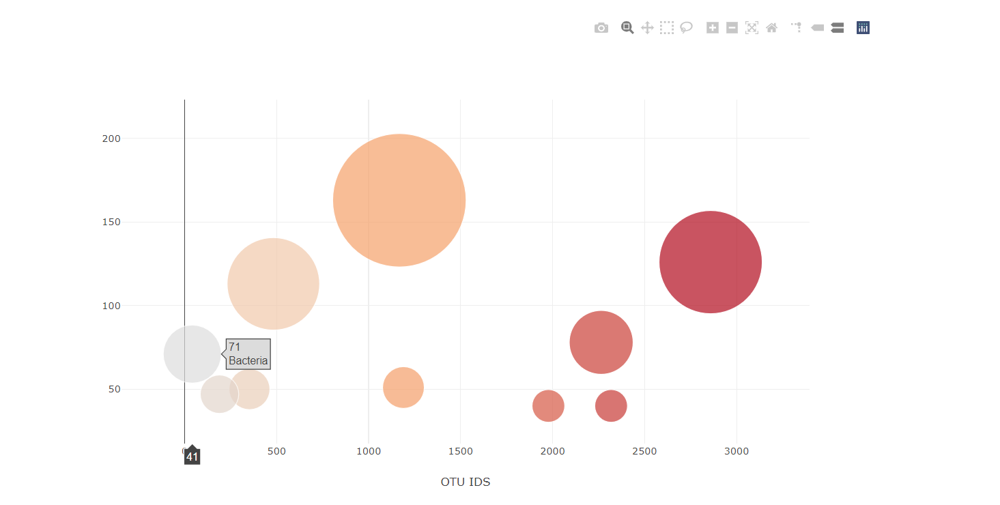

# Plotly_Homework - Belly Button Biodiversity

Assignment: Build an interactive dashboard to explore the [Belly Button Biodiversity dataset](http://robdunnlab.com/projects/belly-button-biodiversity/), which catalogs the microbes that colonize human navels.

The dataset reveals that a small handful of microbial species (also called operational taxonomic units, or OTUs, in the study) were present in more than 70% of people, while the rest were relatively rare.

## Step 1: Plotly

1. Populate a dropdown menu with all of the Sample ID's. When an option is selected, this will update all of the charts.
  
2. Create a horizontal bar chart with a dropdown menu to display the top 10 OTUs found in that individual.

	* Use `sample_values` as the values for the bar chart.
	* Use `otu_ids` as the labels for the bar chart.
	* Use `otu_labels` as the hovertext for the chart.

  

3. Create a bubble chart that displays each sample.

    * Use `otu_ids` for the x values.
    * Use `sample_values` for the y values.
    * Use `sample_values` for the marker size.
    * Use `otu_ids` for the marker colors.
    * Use `otu_labels` for the text values.

4. Display sample metadata, i.e., an individual's demographic information.

	* Display each key-value pair from the metadata JSON object somewhere on the page.

5. Update all of the plots any time that a new sample is selected.

## Advanced Challenge Assignment (Optional)

The following task is advanced and therefore optional.

* Adapt the Gauge Chart from <https://plot.ly/javascript/gauge-charts/> to plot the weekly washing frequency of the individual.

* You will need to modify the example gauge code to account for values ranging from 0 through 9.

* Update the chart whenever a new sample is selected.

## Deployment

* Deploy your app to a free static page hosting service, such as GitHub Pages. Submit the links to your deployment and your GitHub repo.

## References

Hulcr, J. et al.(2012) _A Jungle in There: Bacteria in Belly Buttons are Highly Diverse, but Predictable_. Retrieved from: [http://robdunnlab.com/projects/belly-button-biodiversity/results-and-data/](http://robdunnlab.com/projects/belly-button-biodiversity/results-and-data/)

